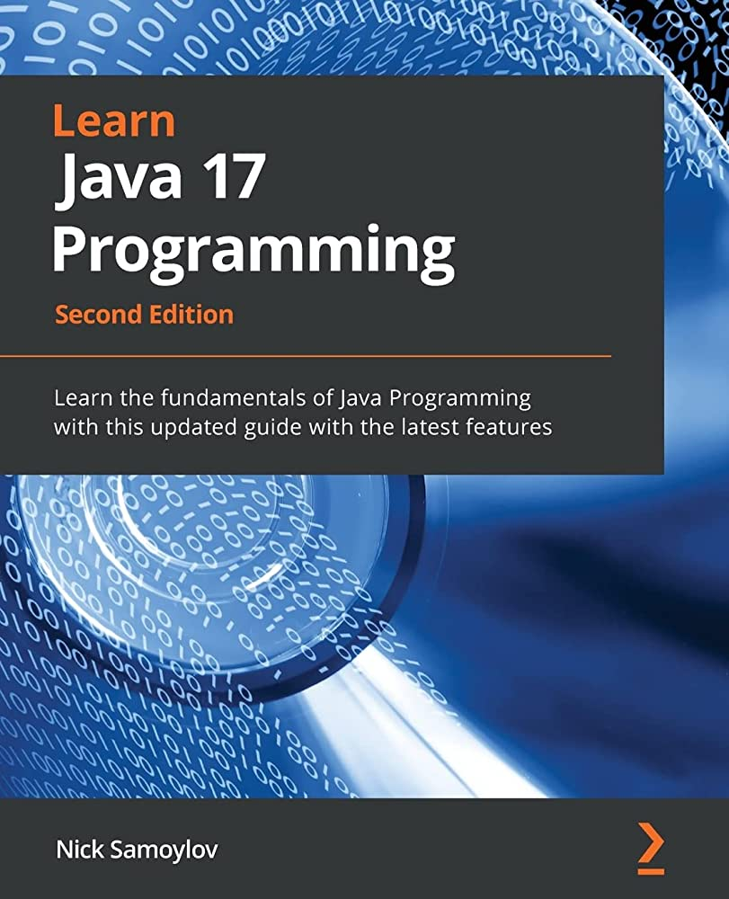

# Learn Java 17 Programming

## When somebody says "java", they may mean quite different things. They could be referring to any of the following:
* Java Programming Language: A high-level programming language that allows an intent (a program) to be expressed in a human-readable format that can be translated into binary code that is executable by a compiler.
* Java Compiler: A program that can read a text written in the java programming language and translate it into bytecode  that can be interpreted by the Java Virtual Machine (JVM) into binary code that is executable by a computer.
* Java Virtual Machine (JVM): A program that reads bytecode of the compiled Java program and interprets it into binary code that is executable by a computer.
* Java Development Kit (JDK): A collection of programs (tools and utilities), including the java compiler, the JVM, and supporting libraries, which allow the compilation and execution of a program written in the java language.
* Java Runtime Environment (JRE): The Java Runtime Environment, or JRE, is a software layer that runs on top of a computer’s operating system software and provides the class libraries and other resources that a specific Java program needs to run.

The task of the compiler is to read a .java file that contains the text of a program written in java (called source code)
and transform (compile) it into bytecode stored in a .class file. The JVM can then read the .class file, interpret the bytecode 
into binary code, and send it to the Operating system for execution. Both the compiler and the JVM have to be invoked explicitly 
from the command line.

Note:
* Sometimes, the JDK is referred to as a Software Development Kit (SDK).
 
* Java Platform and Java Edition applied to the JDK, Since the JDK provides its own operating environment, it is called a platform too.
* A typical platform is an operating system that allows a software program to be developed and executed.
* An edition is a variation of a Java platform (JDK) assembled for a specific purpose.

## There are four java platform editions:
* Java Platform Standard Edition (Java SE): This include the JVM, JCL and other tools and utilities.
* Java Platform Enterprise Edition (Java EE)
* Java Platform Micro Edition (Java ME)
* Java Card
    * Java Card Classic Edition
    * Java Card Connected Edition

## Commands, Tools and Utilities
* javac: This reads a `.java` file, compiles it, and creates one or more corresponding `.class` files, depending on how many java classes are defined in the .java file.
* java: This executes a `.class` file
* jcmd: Facilitates communication with, and diagnosis of, any currently running java process (JVM) and has many options. But in its simplest form, without any options, it lists all currently running java process and their Process IDs (PIDs).
You can use it to see whether you have runaway Java process. If you have, you can then kill such a process using the PID provided.